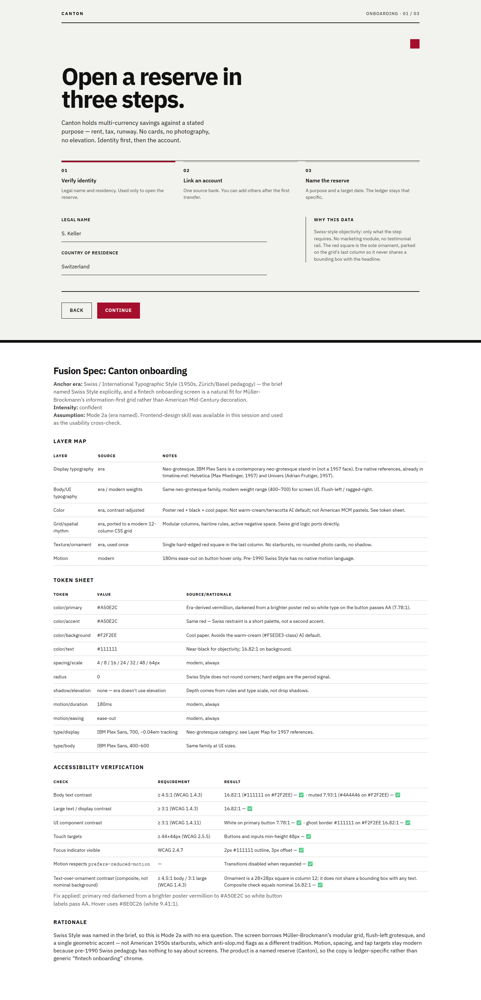
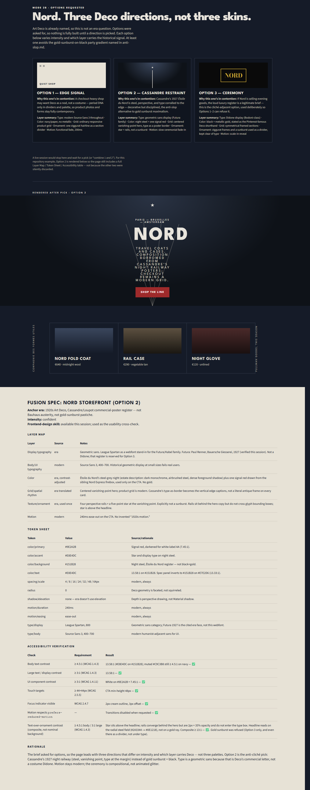
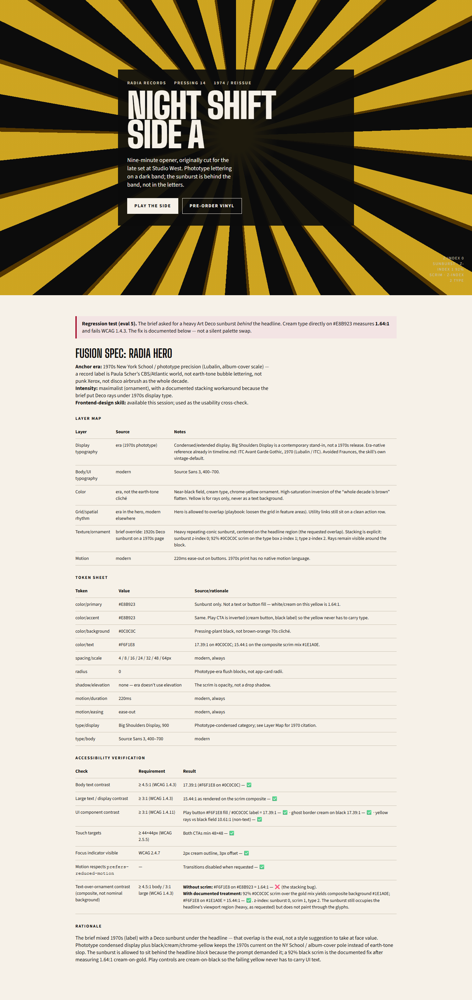
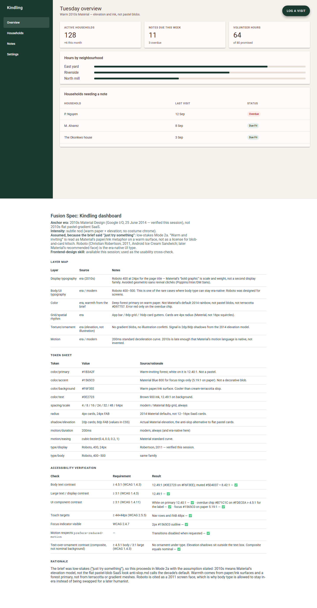

# Design History Fusion

An agent skill that combines historically accurate graphic-design and typography research (1900–present) with modern UI application. It exists so “vintage meets modern” work is grounded in a real movement — dates, type categories, grid logic — instead of a costume palette.

This repository packages **one canonical skill** (`design-history-fusion/`) for Claude, Cursor, and OpenCode without forking or paraphrasing the source. Edit that folder; run `node scripts/sync-packages.mjs` to recopy it.

## What it does

Two modes, chosen by a written decision procedure (not a vibe):

| Mode | When | What you get |
|---|---|---|
| **Research** | Factual / historical questions (“what defined Swiss typography,” “when did Futura come out”) | A sourced, movement-level answer. Specific names, years, and foundries are verified or flagged — not guessed. |
| **Fusion** | Apply a period’s DNA to a modern app, site, poster, package, identity, or editorial | A **Layer Map** (which layer is historical vs modern), a **Token Sheet** (real hex/spacing/type values), an **Accessibility Verification** table, a short rationale, and a render. |

Fusion is a layered translation, not “skin this UI in the 1970s.” Typography, color, grid, ornament, and motion can each pull from a different decade — or stay fully contemporary. Accessibility is never a historical layer.

Fusion itself splits:

- **2a — single direction** when the era is named, or the brief is low-stakes exploration.
- **2b — three directions** when options are requested, or the brief is high-stakes (final, launching, costly to reverse). The three options must differ on era, intensity, or *which layer carries the signal* — not just color.

References under `design-history-fusion/references/` are the rigor standard (`timeline.md`, `anti-slop.md`, `fusion-playbook.md`, `output-templates.md`). Read those; don’t improvise the tables.

## Install

Clone the repo, then copy the **skill folder** (`design-history-fusion/`, the one that contains `SKILL.md`) to the location your tool reads.

### Claude Code

Personal (every project):

```bash
git clone https://github.com/<you>/design-history-fusion.git
cp -R design-history-fusion/design-history-fusion ~/.claude/skills/design-history-fusion
```

PowerShell:

```powershell
Copy-Item -Recurse .\design-history-fusion ~/.claude/skills/design-history-fusion
```

Project-scoped: this repo already contains `.claude/skills/design-history-fusion/` (a synced copy). Opening the repo in Claude Code is enough; or copy that folder into another project’s `.claude/skills/`.

Invoke with `/design-history-fusion` or by asking a design-history / fusion question — the `description` field is written to auto-trigger.

### claude.ai custom skills

1. Enable code execution under Settings → Capabilities.
2. Zip the skill folder so the archive root is the folder itself:

   ```text
   design-history-fusion.zip
    └── design-history-fusion/
         ├── SKILL.md
         ├── references/
         └── evals/
   ```

   Do not zip the whole git repo (README, examples, and tool-specific packages do not belong in the upload).
3. Upload under Customize → Skills and enable the skill.

Claude.ai and Claude Code do not sync skills automatically.

### Cursor

This repo already includes:

- **Skill:** `.cursor/skills/design-history-fusion/` (byte-identical copy of the canonical folder)
- **Rule:** `.cursor/rules/design-history-fusion.mdc` (points at the skill; does not restate `references/`)

Clone and open the project, or copy those two paths into another repo. For a personal install:

```bash
cp -R design-history-fusion ~/.cursor/skills/design-history-fusion
```

The rule is `alwaysApply: false` — attach it when the task is design history or a period-styled UI, or @-mention it. Do not paraphrase the skill into a second document; the rule’s only job is to load `SKILL.md` and the references it names.

### OpenCode

Project install is already at `.opencode/skills/design-history-fusion/`. Global:

```bash
cp -R design-history-fusion ~/.config/opencode/skills/design-history-fusion
```

OpenCode also discovers `.claude/skills/` and `~/.claude/skills/`. Folder name and `name:` frontmatter must stay `design-history-fusion`.

After editing the canonical skill, keep packages identical:

```bash
node scripts/sync-packages.mjs
```

## Usage example

Era named, so Fusion mode 2a — no “which decade do you want?” question:

> Redesign our fintech app’s onboarding screen with Swiss Style meeting modern UI.

Expected shape of the reply (see `examples/2-swiss-fintech-onboarding.html`):

1. Read `references/timeline.md` (and the fusion/anti-slop files) before making type or grid claims.
2. State the blend: neo-grotesque type and modular grid from Swiss Style; spacing, motion, and tap targets modern; ornament limited to one geometric accent.
3. Fill the Layer Map, Token Sheet, and Accessibility Verification tables from `references/output-templates.md` — including the text-over-ornament composite row.
4. Render the screen. Do not substitute American Mid-Century starbursts or rounded photo-cards for Swiss grid discipline.

If the user had instead said “give me a few directions” (eval 4) or “this launches next month, no room to redo it” (high stakes), the skill offers **three** compact options and waits for a pick before building tokens.

## Examples

Four Fusion evals, rendered as single-file HTML (inline CSS, no build step). Each page is the UI **plus** the required spec tables.



**Eval 2 · Swiss / International Style** — fintech onboarding for Canton. Confident intensity; hard-edged red square kept clear of type.



**Eval 4 · 1920s Art Deco** — three options (edge signal / Cassandre restraint / ceremony), then Option 2 built: steel, vanishing point, no gold sunburst.



**Eval 5 · 1970s NY School phototype** — record-label hero with a heavy Deco sunburst *behind* the headline. Stacking-order regression: cream-on-gold is 1.64:1; a 92% scrim brings the composite to 15.44:1. **Check this screenshot by eye before treating the eval as passed.**



**Eval 6 · 2010s Material Design** — low-stakes “just try something.” Assumed current: paper/ink elevation (2014), not flat pastel-gradient SaaS.

Regenerate screenshots after editing an example (Playwright; Chromium is downloaded on first `npx playwright install chromium`):

```bash
npm install
npx playwright install chromium
npm run screenshots
```

## License

MIT. See [LICENSE](LICENSE). Contributions: [CONTRIBUTING.md](CONTRIBUTING.md) — if you edit `references/timeline.md`, bump its **Last reviewed** date.
