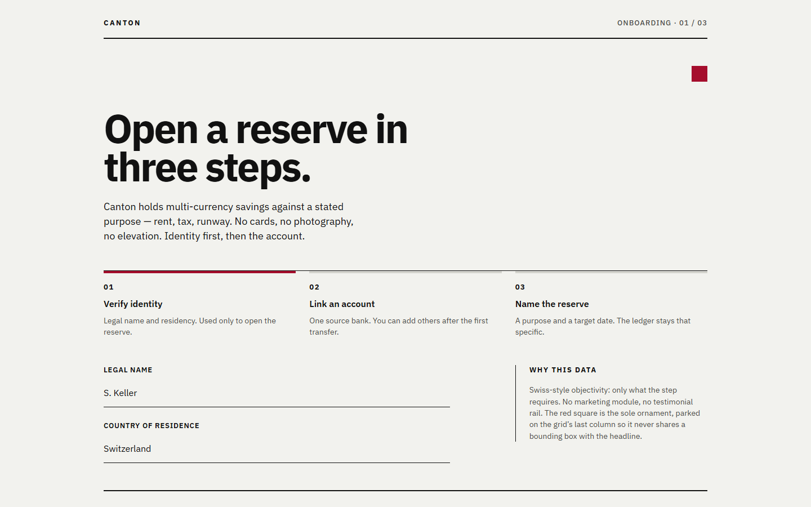
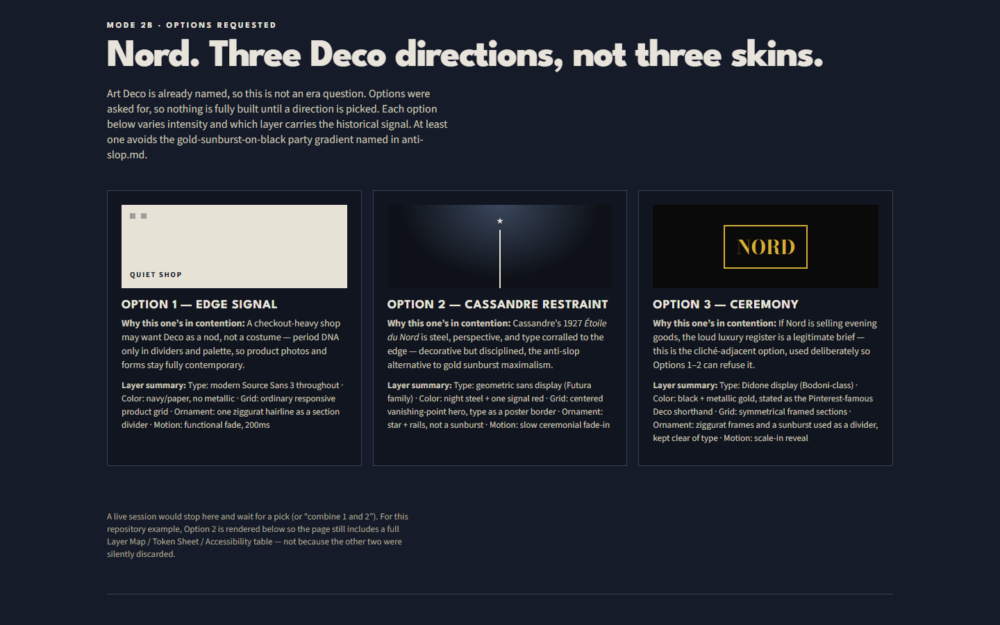
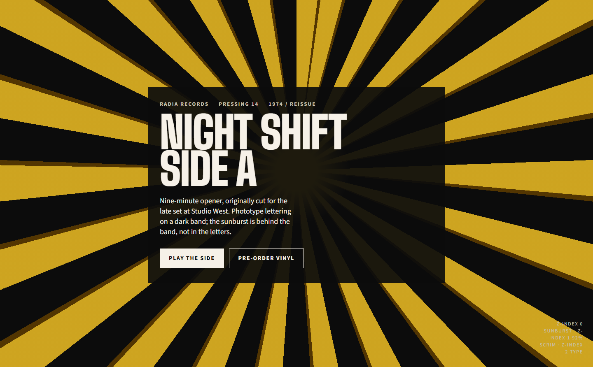
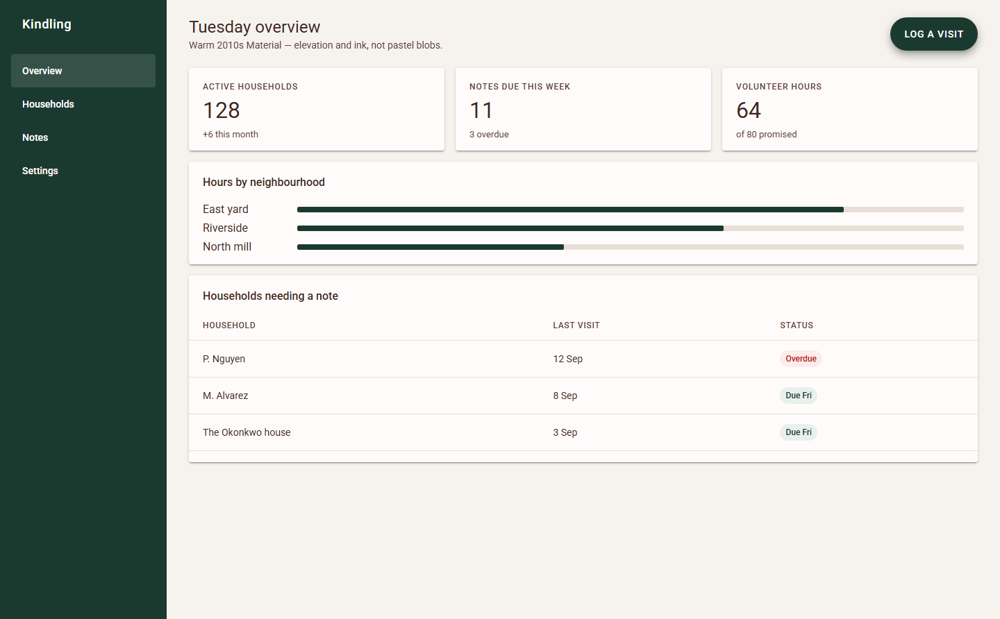

# Design History Fusion

An agent skill for graphic design and typography history (1900–present), and for applying that history to a modern UI, site, poster, package, or identity.

It exists so “vintage meets modern” is a real blend: named movements, type categories, and grid logic, not a costume palette.

The working files are in [`design-history-fusion/`](design-history-fusion/) (`SKILL.md` + `references/` + `evals/`). Claude, Cursor, and OpenCode installs are copies of that folder.

## What it does

| Mode | When | What you get |
|---|---|---|
| **Research** | A historical question (“what defined Swiss typography,” “when did Futura come out”) | A sourced, movement-level answer. Specific names and years are verified or flagged, not guessed. |
| **Fusion** | A modern deliverable that should carry period DNA | A **Layer Map**, **Token Sheet**, **Accessibility Verification** table, a short rationale, and a render. |

Fusion does **not** pick one decade and skin the UI in it. It splits the design into layers (display type, body/UI type, color, grid, ornament, motion, accessibility). Each layer can come from a **different era**, or stay fully modern. That mix is the design decision.

Example: 1970s phototype for the headline, a Swiss modular grid, contemporary body type, Deco ornament used once, motion and tap targets modern. The skill states that blend before it builds (“typography from X, grid from Y, color from Z”) so you can change one layer without throwing out the rest.

You can also ask it to combine two named directions after it offers options (“take the Cassandre type from 2 and the quiet grid from 1”).

Two Fusion shapes:

- **Single direction** when you name an era, or you are exploring (“just try something”).
- **Three directions** when you ask for options, or the brief is high-stakes (final, launching, costly to reverse). The three options differ on era, intensity, or *which layer carries the signal*, not just color.

Accessibility is never a historical layer.

## Install

Clone, then copy the **skill folder** (the inner `design-history-fusion/` that contains `SKILL.md`), not the whole repo.

```bash
git clone https://github.com/matthieu-00/design-history-fusion.git
cd design-history-fusion
```

| Tool | Where to put it |
|---|---|
| **Claude Code** (every project) | `cp -R design-history-fusion ~/.claude/skills/design-history-fusion` |
| **Claude Code** (this repo) | Already at `.claude/skills/design-history-fusion/` |
| **claude.ai** | Zip the inner `design-history-fusion/` folder (SKILL.md at archive root’s first directory), upload under Customize → Skills. Code execution must be on. Do not zip the git repo. |
| **Cursor** | Already at `.cursor/skills/design-history-fusion/` plus rule `.cursor/rules/design-history-fusion.mdc`. Personal: copy the skill folder to `~/.cursor/skills/design-history-fusion` |
| **OpenCode** | Already at `.opencode/skills/design-history-fusion/`. Global: `~/.config/opencode/skills/design-history-fusion` |

On Windows, `Copy-Item -Recurse .\design-history-fusion $HOME\.claude\skills\design-history-fusion` is the Claude Code equivalent.

Invoke with `/design-history-fusion`, or by asking a period-style / “vintage meets modern” question.

## Usage

If you name an era, it goes straight to one Fusion direction:

> Redesign our fintech app’s onboarding screen with Swiss Style meeting modern UI.

Eras combined across layers:

> Swiss grid and neo-grotesque UI type, 1920s Cassandre poster color and a single star mark, modern motion. E-commerce PLP.

Options, then a mix:

> Give me a few Art Deco directions for this shop. I want to look through them.
>
> *(after it replies)* Combine the type from 2 with the quieter ornament from 1.

A full Fusion reply fills the tables in [`references/output-templates.md`](design-history-fusion/references/output-templates.md) and then renders. See [`examples/2-swiss-fintech-onboarding.html`](examples/2-swiss-fintech-onboarding.html).

## Examples

Each file is a single HTML page (inline CSS, no build): the UI, then the Layer Map / Token Sheet / Accessibility tables. Captions name the **anchor** era; other layers may be modern or from a second period.

<p></p>

[Eval 2](examples/2-swiss-fintech-onboarding.html) · **Swiss / International Style.** Fintech onboarding. Neo-grotesque type, modular grid, one hard-edged red square kept clear of type.

<p></p>

[Eval 4](examples/4-art-deco-ecommerce-options.html) · **1920s Art Deco.** Three directions (signal in the edge / Cassandre restraint / ceremony), then the steel vanishing-point shop, not gold sunburst.

<p></p>

[Eval 5](examples/5-1970s-record-label-hero.html) · **1970s phototype** plus a requested Deco sunburst. Headline sits on a documented scrim so rays do not kill contrast.

<p></p>

[Eval 6](examples/6-2010s-saas-dashboard.html) · **2010s Material Design.** Paper/ink elevation, not pastel-gradient SaaS.

## Sources and logic

This is the skill, not a summary of it:

| File | What it is |
|---|---|
| [`design-history-fusion/SKILL.md`](design-history-fusion/SKILL.md) | Modes, 2a vs 2b, layer-by-layer fusion (including mixing eras) |
| [`references/timeline.md`](design-history-fusion/references/timeline.md) | Decade-by-decade movements and principles |
| [`references/typography-atlas.md`](design-history-fusion/references/typography-atlas.md) | Type categories and pairings |
| [`references/fusion-playbook.md`](design-history-fusion/references/fusion-playbook.md) | Layer map, stacking, accessibility |
| [`references/anti-slop.md`](design-history-fusion/references/anti-slop.md) | Cliché table and pre-render checks |
| [`references/output-templates.md`](design-history-fusion/references/output-templates.md) | Required output tables |
| [`references/sources.md`](design-history-fusion/references/sources.md) | Archives to search (Fonts In Use, Letterform Archive, …) |
| [`evals/evals.json`](design-history-fusion/evals/evals.json) | Prompts the skill is tested against |

## License

MIT. See [LICENSE](LICENSE). If you change `references/timeline.md`, bump its **Last reviewed** date ([CONTRIBUTING.md](CONTRIBUTING.md)).
